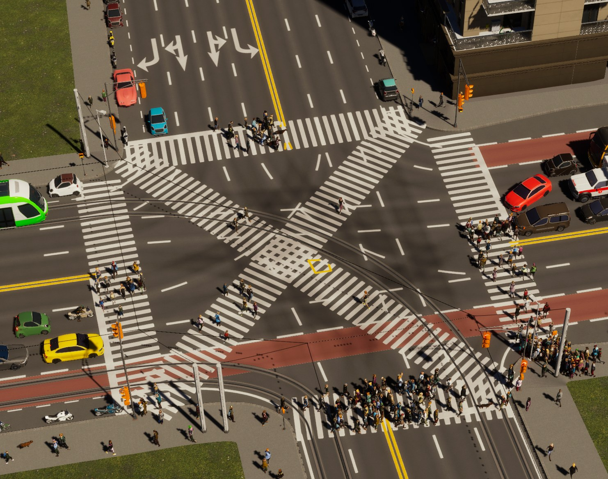

# Better Crosswalks

A Cities: Skylines II code mod for pedestrian crossings: make them wider, shape them one at a time,
give them a painted border, and add crossings corner to corner through the middle of a junction.

Crossings in Cities: Skylines II are a thin painted band that a queue of citizens shuffles across in
single file. This widens the band and the strip people walk on together, so a crowd spreads out
across it instead of filing over.



## What it does

**Width, everywhere.** One slider, as a percentage of whatever width the crossing was drawn with
rather than an absolute figure — crossings are not uniform to begin with, a side street's is narrow
and a boulevard's is not, and one absolute value would flatten that. 150% out of the box, 25%–400%
by hand. A floor and a ceiling in metres are there for the cases where a proportion is not what you
want: "no crossing narrower than 4m" is a sensible rule, "every crossing exactly 4m" usually is not.

**One junction at a time.** The toolbar button opens a tool. Click a junction, then a crossing on
it, and five rings appear on that crossing:

| Ring | Drag it to |
| --- | --- |
| Either end | Swing that end up or down the road, for a crossing set at an angle rather than square across |
| The middle | Slide the whole crossing towards or away from the junction |
| Either side | Pull the crossing wider or narrower |

Nothing you do to one crossing touches its neighbours. The panel also has **−** and **+**, *Same for
all N crossings here*, and a reset for the crossing or the whole junction. Everything set here is
saved with the city.

**Crossings through the middle.** Junctions where four or more roads meet can take crossings corner
to corner through the middle — a scramble crossing, the kind Shibuya is known for. On by default,
and the tool edits and removes them like any other crossing.

**Lines down the sides.** A solid line either side of the zebra stripes, so the crossing reads as a
bordered band rather than a row of loose bars. The lines sit on the edge of the band and follow it,
so a crossing you widen takes its borders with it. Off out of the box, since it changes how every
crossing in the city looks.

They are the game's own road markings, laid by the game's own marking system, so they match whatever
the city's roads are painted with — a **Line style** dropdown picks between the ones found if the
automatic choice is not the one you want. They appear only where the game paints a zebra: never on
the unmarked crossings it lays at every junction, and never on the lane it substitutes where there is
no pavement to step onto. Crossings through the middle get them too, laid by the mod rather than the
game, and theirs follow the moment you resize one.

Because the game lays the rest with the junction and saves them with the city, a junction keeps the
lines it was built with until something rebuilds it — *Apply to existing crossings and lines* is what
brings a city you already have up to date.

**Hide a crossing's paint.** *Hide crossing paint* in the tool panel stops the selected crossing
being drawn — zebra and side lines — while leaving it a crossing in every other respect: people still
cross there, its signals still run, and it keeps its width and position. *Show crossing paint* or
*Reset this crossing* brings it back.

## How it works

A crossing is not part of the road's cross-section. It is a **lane laid across the carriageway**:

- `NetPieceCrosswalk` on a road piece declares a span across the road and names a lane prefab, which
  becomes `NetCrosswalkData` on that piece.
- `AddCompositionCrosswalks` merges adjacent spans into one `NetCompositionCrosswalk` per
  composition.
- `LaneSystem` lays a pedestrian lane along that span at every node.

A crossing lane runs across the road, so its width is the depth of the painted band in the direction
traffic travels. That width is two numbers added together:

```
NetLaneData.m_Width  +  NodeLane.m_WidthOffset
```

and the two are read differently. `CreatureUtils.GetLaneOffset` takes the **sum**, which is what
spreads the walkers out. `BatchDataHelpers.BuildCurveScale` returns the **ratio**
`1 + m_WidthOffset / m_Width` and uses it as the mesh's lateral scale, which is what paints the
zebra. Move only the prefab's `m_Width` and both terms shift together: the crossing behaves wider
without ever looking it. **That is the mistake this mod made for several versions.**

So width is applied **per crossing**, by writing `NodeLane.m_WidthOffset` on the lane the game laid.
Note that field is not zero to begin with — `LaneSystem` writes `declaredWidth − variantWidth` into
it to hold a theme variant at the width the composition declared — so the value written is
`scale × laidWidth − variantWidth`, with `laidWidth` taken from the declaring placeholder. At 100%
that reproduces the game's own number exactly, which is what makes "off", "restore" and "remove my
data" the same code path as "apply".

No cloned prefabs, no shared prefab widths rewritten, no geometry of the mod's own, and no Harmony
patches. The road itself never gets wider.

Crossings through the middle are the one exception: those are lanes this mod creates. Nothing about
them is invented — the entity comes from `NetLaneArchetypeData.m_NodeLaneArchetype`, and its path
nodes, prefab, flags, signal and `NodeLane` are copied off crossings already standing at that
junction, so the diagonal is an edge between two vertices already in the pedestrian graph and takes
the same paint, width rules and green phase. They deliberately carry **no `Owner`**; see
[NOTES.md](NOTES.md) for why that one detail is the difference between working and taking the game
down.

The lines down a crossing's sides draw nothing of the mod's either. The game already lays painted
markings beside lanes, entirely from prefab data: a marking prefab carries `SecondaryLaneData` saying
how it is placed, and every lane prefab that wants one beside it carries a `SecondaryNetLane` buffer
naming it. For a lane with nothing alongside, `SecondaryLaneSystem` lays it at

```
NetUtils.OffsetCurveLeftSmooth(laneCurve, laneWidth * -0.5f - cutOffset)
```

and reads `laneWidth` as the same `m_Width + m_WidthOffset` pair above. So the whole feature is one
buffer entry written onto each crossing lane prefab: the lines land on the edge of the band, follow
it as it is widened, and are created and destroyed with their junction by the game. Prefab entities
are excluded from a city save, so the entry reaches no save; the lanes laid from it are ordinary
markings like every other.

The entry carries `Left | Right | OneSided | RequireSafe` — both sides, only where the crossing has
no lane beside it, and only where the crossing is one the game actually paints. Crossings through the
middle are the exception again: `SecondaryLaneSystem` finds lanes by walking each junction's lane
list and those are deliberately not in one, so the mod lays their lines itself, at the same offset,
recomputed every pass.

## Applying it

Change the setting and the whole city follows on the next frame — crossings already standing
included. There is nothing to press and nothing to reload.

That is worth saying because it used to be false, and because the obvious mechanism is the wrong
one. Width lives on lanes that are already laid, so applying it is a sweep that writes one number
per crossing; it does **not** hand nodes back to `LaneSystem` to be laid again. The old route did,
and it destroyed and rebuilt every lane at every junction in the city to change one number on each.

The lines are the exception, and the reason *Apply to existing crossings and lines* exists. Those are
laid by the game when a junction is built and are **saved with the city**, so a junction keeps the
lines it was built with until something rebuilds it — which is why a change to where the lines belong
appears to do nothing on a city that already has them, while a junction you happen to edit comes out
right. The button hands every road back to the pipeline when the lines are on, which re-lays them
against the prefab as it now stands. It is on a button and never on load, deliberately: a whole city
re-laid without being asked for is the sort of automatic tidying that once made a save unopenable.

## Removing it

**Maintenance → Remove this mod's data from the city**, then save. Every crossing goes back to the
width its asset author chose, every per-junction width is forgotten, every crossing this mod added
is taken out, and the mod switches itself off so nothing puts them back before you save. The save is
then exactly as it would have been if the mod had never run.

*Put every crossing back to normal* does the same to the city but leaves the mod switched on, so you
can carry on from a city that looks untouched.

## Compatibility

Requires Cities: Skylines II **1.6**.

Mods that add or remove crossings, or change where they sit, are fine: they work on the span and the
composition, neither of which this mod touches. Anything else that writes `NodeLane.m_WidthOffset`
on crossing lanes will conflict — last writer wins.

## Building

Requires the official Cities: Skylines II modding toolchain, which sets `CSII_TOOLPATH` and the
other `CSII_*` environment variables the project imports.

```
dotnet build CS2-CrosswalkWidth.sln -c Release
```

The UI half is built separately with npm — see [ui/README.md](ui/README.md) for first-time setup.
**Both halves have to be built**, and a stale UI bundle beside a fresh DLL loads without complaint
and silently behaves like the older version. Both deploy into the same folder, and the project
overrides the toolchain's `DeployWIP` target so that building one does not delete the other.

`Properties/thumbnail.py` draws the store cover; `pip install cairosvg` first.

## A note on the name

The assembly, the namespace and the settings key are all still `CrosswalkWidth`, and they stay that
way on purpose. The settings key is what the game files a player's saved settings under, and the
component type names are written into every city save that has used this mod — renaming them would
reset one and break the other. Only the name players see is *Better Crosswalks*.

## Notes

[NOTES.md](NOTES.md) is the record of what was expensive to learn: the unguarded indexing in
`TrafficLightInitializationSystem` behind six crashes, why a lane index is two numbers rather than a
counter, why a mod must never tag a node `Updated`, and the approaches that were tried and removed
so they are not tried again.
